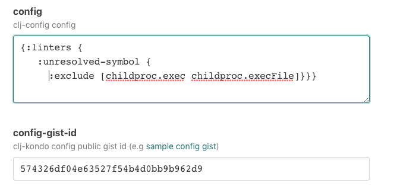

# `@atomist/clj-kondo-skill`

> "A linter for Clojure code that sparks joy."

Lint your Clojure code using [clj-kondo][clj-kondo], get GitHub CheckRuns with warnings and errors.

<!---atomist-skill-readme:start--->

# What it's useful for

Keep track of lint warnings and errors across your repositories.

-   Run `clj-kondo` with the same consistent configuration across all of your Clojure code
-   Distinguish new warnings and violations from ones that were already present
-   Share `clj-kondo` configurations with other teams using GitHub gists

# Before you get started

The **GitHub** integration must be configured in order to use this skill.
At least one repository must be selected.

# How to configure

1.  **Specify a custom configuration**

    The [configuration][configuration] that you specify will be used across all repositories.  
    To encourage the use of shared configurations, you can also reference a public URL --
    for example, a gist is a great way to share configurations).

    To use a configuration from a public URL, leave the **Custom configuration** field blank
    and reference the URL in the **Custom configuration URL** field. Here is an example of public gist containing a
    [sample config.edn](https://gist.githubusercontent.com/slimslenderslacks/574326df04e63527f54b4d0bb9b962d9/raw/8e0e3e6a691c434a63b661ae3869dd181c4fbb89/config.edn).

    

1.  **Select repositories**

    By default, this skill will be enabled for all repositories in all organizations you have connected. To restrict
    the organizations or specific repositories on which the skill will run, you can explicitly
    choose organization(s) and repositories.

    Either select all, if all your repositories should participate, or choose a subset of repositories that should
    stay formatted. This skill will take no action on repositories that do not contain `.clj`, `.cljs`, or `cljc` files.

    

# How to Use

1. **Configure the skill as described above**

1. **Commit and push your code changes**

1. **See clj-kondo results as [Checks][checks] in your commit on GitHub!**

There are already great ways to integrate [clj-kondo][clj-kondo] into your local development flow. See the docs on
[editor integration here][editor-integration].

To create feature requests or bug reports, create an [issue in the repository for this skill](https://github.com/atomist-skills/clj-kondo-skill/issues).
See the [code](https://github.com/atomist-skills/clj-kondo-skill) for the skill.

[clj-kondo]: https://github.com/borkdude/clj-kondo
[configuration]: https://github.com/borkdude/clj-kondo/blob/master/doc/config.md
[editor-integration]: https://github.com/borkdude/clj-kondo/blob/master/doc/editor-integration.md
[gist-url]: https://gist.githubusercontent.com/slimslenderslacks/574326df04e63527f54b4d0bb9b962d9/raw/8e0e3e6a691c434a63b661ae3869dd181c4fbb89/config.edn

<!---atomist-skill-readme:end--->

---

Created by [Atomist][atomist].
Need Help? [Join our Slack workspace][slack].

[atomist]: https://atomist.com/ "Atomist - How Teams Deliver Software"
[slack]: https://join.atomist.com/ "Atomist Community Slack"
[checks]: https://help.github.com/en/enterprise/2.15/user/articles/about-status-checks#checks "GitHub Checks"
