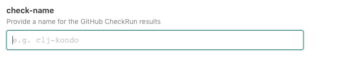

# `@atomist/clj-kondo-skill`

<!---atomist-skill-readme:start--->

> "A linter for Clojure code that sparks joy."

Lint your clojure code using [clj-kondo][clj-kondo], get GitHub CheckRuns with warnings and errors.
  
# What it's useful for

Keep track of lint warnings and errors across your repositories.

* Run `clj-kondo` with the same consistent configuration across all of your Clojure code
* Share `clj-kondo` configurations with other teams using GitHub gists.
* Distinguish new warnings and violations from ones that were already present.

# Before you get started

The **GitHub** integration must be configured in order to use this skill. 
At least one repository must be selected. 

# How to configure

1.  **Optionally choose the name of the CheckRun**

    
    
2.  **Choose a custom clj-kondo configuration**

    This [clj-kondo configuration][configuration] can be shared across multiple Repositories.  
    To encourage sharing configs, users can also reference a public url (e.g. a gist url is a great
    way to share configurations).  To share a public configuration, leave the config form element blank 
    and reference a url.  Here is an example of public gist containing a 
    [sample config.edn](https://gist.githubusercontent.com/slimslenderslacks/574326df04e63527f54b4d0bb9b962d9/raw/8e0e3e6a691c434a63b661ae3869dd181c4fbb89/config.edn).
    
    
                        
3.  **Select repositories**

    By default, this skill will be enabled for all repositories in all organizations you have connected. To restrict 
    the organizations or specific repositories on which the skill will run, you can explicitly 
    choose organization(s) and repositories.

    Either select all, if all your repositories should participate, or choose a subset of repositories that should 
    stay formatted.  This skill will take no action on repositories that do not contain `.clj`, `.cljs`, or `cljc` files.
    
        

# How to Use

1. **Configure the skill as described above**

1. **Commit and push your code changes** 

1. **See clj-kondo results in your GitHub CheckRun statuses!**

There are already great ways to integrate [clj-kondo][clj-kondo] into your local development flow.  See the docs on
[editor integration here][editor-integration].  Perhaps you are already making commits free from linting errors or warnings.
If so, this skill will produce a GitHub CheckRun confirming this.  If not, 
the data may encourage users to consider adding this clj-kondo feedback in to their development flow.  In both cases, this
data is now available to downstream automation.

To create feature requests or bug reports, create an [issue in the repository for this skill](https://github.com/atomist-skills/clj-kondo-skill/issues). 
See the [code](https://github.com/atomist-skills/clj-kondo-skill) for the skill.

[clj-kondo]: https://github.com/borkdude/clj-kondo
[configuration]: https://github.com/borkdude/clj-kondo/blob/master/doc/config.md
[editor-integration]: https://github.com/borkdude/clj-kondo/blob/master/doc/editor-integration.md
[gist-url]: https://gist.githubusercontent.com/slimslenderslacks/574326df04e63527f54b4d0bb9b962d9/raw/8e0e3e6a691c434a63b661ae3869dd181c4fbb89/config.edn

<!---atomist-skill-readme:end--->

---

Created by [Atomist][atomist].
Need Help?  [Join our Slack workspace][slack].

[atomist]: https://atomist.com/ (Atomist - How Teams Deliver Software)
[slack]: https://join.atomist.com/ (Atomist Community Slack)